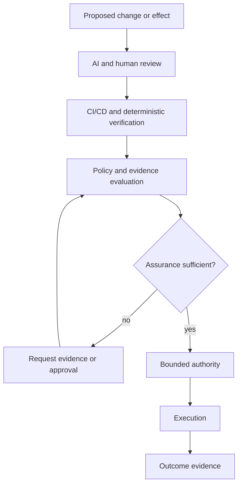

AI-assisted development has moved beyond code completion.

Models can generate implementations, inspect diffs, explain failures, propose tests, review pull requests, and iterate on their own mistakes. CI/CD already handles another large part of the problem: build, test, scan, package, verify, and block known failure conditions.

That leaves a different question:

**What assurance is actually required before a proposed action should be allowed to happen?**

That is not a generation problem. It is not a review problem. It is broader than CI/CD.

It is a governance problem.

<Callout>

AI review provides judgment. CI/CD provides executable evidence. Precise governance decides whether that evidence is sufficient for the consequence being proposed, and what authority may follow.

</Callout>

## Three different jobs

Review, verification, and governance are complementary. Treating them as interchangeable weakens all three.



### Review is judgment

AI is already useful for code and architecture review because review is partly a reasoning task.

It can find:

- architecture drift;
- duplicated responsibilities;
- unsafe assumptions;
- suspicious edge cases;
- missing failure handling;
- tests that pass while missing the real invariant.

Recent agent-assisted work has repeatedly reinforced this. AI review has caught release-verification mistakes, unsafe path handling, and mismatches between implementation and declared behavior that deterministic checks did not identify first.

That is useful capacity.

It is still judgment.

A strong review does not itself establish execution authority.

### CI/CD is executable evidence

CI/CD is strongest where expectations can be made executable.

It can establish that:

- the repository builds;
- unit and integration tests pass;
- schemas remain compatible;
- static analysis finds no blocked condition;
- dependency policy is satisfied;
- an artifact has a particular digest;
- a deployment smoke test succeeds.

This distinction has held across years of platform work. A fix is more durable when it is encoded into the repository and enforced by CI/CD than when it exists as a manual operational procedure. The repository becomes the control surface; the pipeline provides repeatable evidence.

But green CI does not answer whether the evidence is **sufficient** for a particular consequence.

A documentation correction and a production credential rotation may both pass every configured check. They should not receive the same authorization treatment.

### Governance decides sufficiency

Governance asks a different set of questions:

- What effect is being requested?
- Which actor or workload is requesting it?
- Which policy applies?
- What is the blast radius?
- Which evidence is required?
- Is that evidence current and attributable?
- Is explicit approval required?
- What exact authority should be granted if the requirements are satisfied?

This is the role Anthesis is exploring.

Anthesis should not replace review or CI. Its more useful role is to consume their outputs as evidence inside a policy decision.

## The pattern already exists in production engineering

This is not entirely new.

On regulated mobile platforms, a security finding was never reduced to a binary scanner result. Findings had to be understood in context: exploitability, affected surface, compensating controls, remediation cost, release risk, and whether residual risk could be accepted and monitored.

Authentication work followed the same pattern. A build could be correct, tests could be green, and the change could still be wrong for the trust boundary. Client authentication is not simply web authentication moved onto a phone. Device state, token handling, platform security, password managers, third-party SDK behavior, and backend contracts all affect the decision.

The principal-engineering question was rarely just:

> Did the implementation pass?

It was closer to:

> Is the evidence sufficient for this exact change, in this exact trust boundary, with this exact blast radius?

Agentic systems make that question explicit because the system may be able to act immediately after answering it.

## Governance as an assurance scheduler

The obvious failure mode is bureaucracy.

If every action receives the same process, governance becomes another bottleneck: review everything, test everything, approve everything, then wait for a human.

A better model is **risk-proportional assurance**.

The objective is not minimum verification. It is the **cheapest sufficient assurance** for the consequence being proposed.

A documentation correction may need repository validation and link checking.

A dependency update may need build and test evidence, vulnerability scanning, provenance checks, and review of API impact.

A production deployment may need all of that plus exact artifact identity, deployment-specific policy, and explicit approval.

A credential or authorization-policy change may need a stronger path again.

That is closer to how experienced engineering organizations already operate. High-consequence changes receive more scrutiny. Routine changes should not consume the same human attention.

The governance layer makes that allocation explicit and machine-evaluable.

## Why agents make the gap visible

Traditional automation usually follows a fixed workflow.

Agentic systems can propose the workflow as they go:

```text
inspect repository
  -> discover failing workflow
  -> edit configuration
  -> rerun tests
  -> change dependency
  -> create pull request
  -> perhaps merge or deploy
```

The complete plan may not be known at the start.

That makes static permission models awkward.

Broad credentials create excessive authority because the agent might need them later. Human approval on every step destroys much of the value of autonomy.

A policy boundary can evaluate the **actual proposed effect** instead:

```text
agent intent
  -> normalized requested effect
  -> policy and risk evaluation
  -> required evidence
       - AI or human review
       - CI results
       - security checks
       - artifact provenance
       - approval
  -> evidence satisfies policy?
  -> bounded capability
  -> execution
  -> outcome evidence
```

The model can remain probabilistic while the consequential boundary remains deterministic.

That separation matters more than trying to make the model itself perfectly trustworthy.

## Evidence is not authority

A passing test is evidence.

A positive AI review is evidence.

A signed artifact is evidence.

A human approval is evidence.

None of those should automatically become authority by itself.

A signature may establish who produced an artifact. It does not establish that a particular runtime is authorized to deploy that artifact to production now.

CI can establish that a change passes every configured test. It does not establish that the requested effect still matches current intent.

A scanner can establish that a condition was found. It does not decide the remediation path, compensating controls, accepted risk, or whether execution should proceed.

The distinction is simple:

```text
observation
  != evidence
  != policy decision
  != capability
  != execution
```

Collapsing those stages makes systems convenient. It also makes them difficult to govern.

## Precise governance has to be precise

Calling a system "policy based" is not enough.

A governance layer that routes most uncertainty to humans is not precise. It is a manual approval queue with extra steps.

A governance layer that accepts vague natural-language intent as authority has the opposite problem: sophisticated automation on top of an imprecise permission model.

Several properties matter.

### Effects need stable identities

"Change the repository" is too broad.

The boundary should distinguish effects such as modifying documentation, changing source code, updating a dependency, accessing a secret, sending a network request, merging a branch, publishing an artifact, deploying a service, or changing authorization policy.

### Evidence needs provenance

Policy needs to know what produced the evidence and what it applies to.

A test result from commit `A` should not silently authorize commit `B`. Approval for one deployment target should not automatically apply to another.

### Authority needs scope

A successful decision should grant the narrow authority required for the effect, not turn the requesting agent into a generally trusted actor.

### Uncertainty needs an explicit path

Sometimes the correct result is escalation.

Escalation should be a policy outcome, not the default consequence of poor modeling.

## Anthesis and the assurance boundary

Anthesis currently explores the boundary between reasoning and consequence through deterministic policy contracts and evidence-bound governance scenarios.

The public Governance Lab focuses on evaluator behavior. It does not claim that arbitrary agents are impossible to bypass.

That distinction is important.

A policy engine can make a correct decision while an execution environment still exposes an uncontrolled path around it. Security engineering has long had versions of this problem: a well-designed control is irrelevant if another path can bypass the control entirely.

The larger architectural target is this sequence:

```text
proposal
  -> exact policy decision
  -> exact evidence requirements
  -> exact approval where required
  -> bounded capability
  -> attributable execution
```

If that sequence holds, governance can **increase** useful autonomy rather than reduce it.

Low-risk work can proceed quickly because inexpensive automated evidence is sufficient. High-risk work receives stronger scrutiny because human attention has been preserved for it.

That is governance as an executable engineering boundary, not a policy document wrapped around an agent.

## The assurance stack

A practical assurance stack looks roughly like this:

```text
generation
  AI coding and task agents
      |
      v
review
  humans + AI reviewers
      |
      v
verification
  CI/CD + deterministic tests + security tooling
      |
      v
governance
  intent + policy + evidence sufficiency + approval
      |
      v
authority
  bounded capability
      |
      v
execution
  tool / service / deployment boundary
      |
      v
evidence
  attributable outcome + provenance
```

The layers feed back into one another. Failed CI returns work to an agent. Review requests another implementation. Policy requires more evidence. Execution results trigger reassessment.

The important part is not the diagram.

It is keeping the claims separate.

Review says what looks right.

Verification says what was demonstrated.

Governance says whether that demonstration is sufficient for the requested consequence.

Authority says what may happen next.

## The point

AI is becoming effective at producing software and increasingly useful at reviewing it.

CI/CD remains effective at turning engineering expectations into executable evidence.

The missing layer is deciding, precisely and reproducibly, **which assurance is sufficient for which consequence**.

That has always been part of senior engineering judgment. Agentic systems force it to become explicit architecture.

If policy-based governance can encode that judgment without flattening every action into the same approval path, governance does not have to slow autonomous engineering down.

It can be the mechanism that makes more autonomy acceptable.
