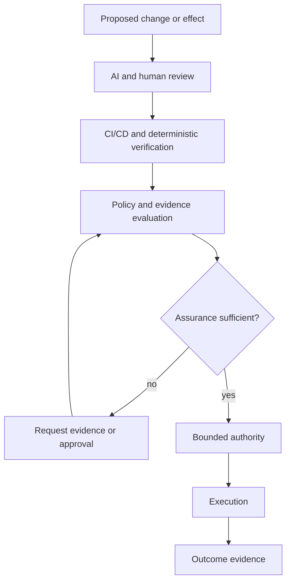

AI-assisted development has moved quickly from code completion toward something closer to an engineering collaborator.

Models can generate implementations, inspect diffs, explain bugs, propose tests, review pull requests, and iterate on their own mistakes. CI/CD systems already handle another part of the problem well: they build software, run deterministic checks, exercise integration paths, scan dependencies, validate artifacts, and block known failure conditions.

That leaves a different question:

**Given a proposed action, what assurance is actually required before the system should be allowed to perform it?**

That is not primarily a generation problem. It is not exactly a review problem either. It is broader than CI/CD.

It is a governance problem.

<Callout>

AI review provides judgment. CI/CD provides executable evidence. Precise governance decides which evidence is sufficient for a particular consequence and what authority may follow.

</Callout>

## Three different jobs

AI review, CI/CD, and governance are sometimes treated as competing approaches to the same problem. They are more useful as separate assurance layers.



### AI review is judgment

AI is increasingly useful for review because review is partly a reasoning task.

A reviewer can look for conditions that are difficult to encode as a single deterministic test:

- architecture drift;
- duplicated responsibilities;
- unsafe assumptions;
- suspicious edge cases;
- inconsistent error handling;
- unnecessary complexity;
- missing threat-model considerations;
- tests that technically pass but fail to exercise the real invariant.

Human review remains important, but AI can add substantial review capacity.

The limitation is that a review result is still a **judgment**. Even a strong judgment does not itself establish execution authority.

### CI/CD is executable evidence

CI/CD is strong where expected behavior can be made executable.

It can establish that:

- a repository builds;
- unit and integration tests pass;
- schemas remain compatible;
- static analysis finds no blocked condition;
- dependency policy is satisfied;
- an artifact has a particular digest;
- cross-language golden vectors agree;
- a deployment smoke test succeeds.

That evidence is often stronger than prose because it is reproducible and attributable to a specific build or artifact.

But CI/CD does not inherently know whether passing those checks is **enough** for a particular action.

A documentation correction and a production credential rotation may both have green CI. They should not necessarily receive the same authorization treatment.

### Governance decides sufficiency

The missing layer asks a different set of questions:

- What effect is being requested?
- Which actor or workload is requesting it?
- Which policy applies?
- What risk does the action carry?
- Which evidence is required?
- Is that evidence current and attributable?
- Is explicit human approval required?
- What exact authority should be granted if the requirements are satisfied?

This is the role Anthesis is exploring.

Anthesis is not intended to replace review or CI. Its more useful role is to treat their outputs as evidence inside a deterministic policy decision.

## Governance as an assurance scheduler

The obvious failure mode for governance is bureaucracy.

If every action receives the same heavyweight process, governance becomes another bottleneck: review everything, test everything, approve everything, then wait for a human.

A more useful model is **risk-proportional assurance**.

The objective is not to minimize verification. It is to require the **cheapest sufficient assurance** for the consequence being proposed.

A documentation correction may need repository validation and link checking.

A dependency update may need build and test evidence, vulnerability scanning, provenance checks, and review of resulting API changes.

A production deployment may need all of that plus an exact artifact identity, deployment-specific policy, and explicit approval.

A credential or authorization-policy change may require a stronger path again.

In that model, governance schedules scarce assurance resources rather than merely returning `allow` or `deny`.

Human attention is one of those scarce resources.

## Why this matters more for agents

Traditional automation usually follows a relatively fixed workflow. Agentic systems can propose actions dynamically:

```text
inspect repository
  -> discover failing workflow
  -> edit configuration
  -> rerun tests
  -> change dependency
  -> create pull request
  -> perhaps merge or deploy
```

The complete plan may not be known when the workflow begins.

That flexibility makes static permission models awkward. Giving an agent broad credentials because those credentials might eventually be needed creates excessive authority. Requiring a human to approve every small step destroys much of the benefit of autonomy.

A policy boundary can instead evaluate the **actual proposed effect**:

```text
agent intent
  -> normalized requested effect
  -> policy and risk evaluation
  -> required evidence
       - AI or human review
       - CI results
       - security checks
       - artifact provenance
       - prior approval
  -> evidence satisfies policy?
  -> bounded capability
  -> execution
  -> outcome evidence
```

The model can remain probabilistic while the consequential boundary remains deterministic.

## Evidence is not authority

A passing test is evidence.

A positive AI review is evidence.

A signed artifact is evidence.

A human approval is evidence.

None of those should automatically become authority by itself.

A signature may establish that a particular publisher produced an artifact. It does not establish that a particular system is authorized to deploy that artifact to production now.

CI can establish that a change passes every required test. It does not establish that the requested effect still matches current intent.

This separation becomes more important as agents chain actions together:

```text
observation
  != evidence
  != policy decision
  != capability
  != execution
```

Collapsing those stages is convenient, but it becomes difficult to explain why an action was allowed or which fact actually authorized it.

## Precise governance has to be precise

Calling a system "policy based" is not enough.

A governance layer that classifies most uncertainty as high risk routes everything to humans and becomes unusable. A governance layer that treats vague natural-language intent as sufficient authority creates the opposite failure: sophisticated automation on top of an imprecise permission model.

Several properties matter if policy-based governance is going to improve throughput rather than obstruct it.

### Effects need stable identities

"Change the repository" is too broad.

The boundary needs to distinguish effects such as modifying documentation, changing source code, updating a dependency, accessing a secret, sending a network request, merging a branch, publishing an artifact, deploying a service, or changing an authorization policy.

### Evidence needs provenance

Policy needs to know what produced the evidence and exactly what the evidence applies to.

A test result from commit `A` should not silently authorize commit `B`. An approval for one deployment target should not automatically apply to another.

### Authority needs scope

A successful governance decision should grant the narrow authority required for the effect, not convert the requesting agent into a generally trusted actor.

### Uncertainty needs an explicit path

Sometimes the correct result is escalation.

Escalation should be a policy outcome, not the default consequence of failing to model the requested action precisely.

## Anthesis and the assurance boundary

Anthesis currently explores the separation between reasoning and consequence through deterministic policy contracts and evidence-bound governance scenarios.

The public Governance Lab focuses on proving evaluator behavior rather than claiming that arbitrary agents are impossible to bypass. That distinction matters. A policy engine can make a correct decision while an execution environment still contains an uncontrolled path around it.

The larger architectural question is whether an execution boundary can reliably preserve this sequence:

```text
proposal
  -> exact policy decision
  -> exact evidence requirements
  -> exact approval where required
  -> bounded capability
  -> attributable execution
```

If that works, governance can potentially **increase** useful autonomy rather than reduce it.

Low-risk actions can proceed quickly when inexpensive automated evidence is sufficient. High-risk actions can receive stronger scrutiny because human attention has been preserved for the places where it matters.

That is governance as an executable engineering boundary rather than a set of broad organizational principles.

## The assurance stack

A practical assurance stack for agentic systems can be expressed as:

```text
generation
  AI coding and task agents
      |
      v
review
  humans + AI reviewers
      |
      v
verification
  CI/CD + deterministic tests + security tooling
      |
      v
governance
  intent + policy + evidence sufficiency + approval
      |
      v
authority
  bounded capability
      |
      v
execution
  tool / service / deployment boundary
      |
      v
evidence
  attributable outcome + provenance
```

The layers can feed back into one another. Failed CI can return work to an agent. Review can request another implementation. Policy can require additional evidence. Execution results can trigger reassessment.

Keeping the responsibilities distinct makes the system easier to reason about and gives each layer a more precise claim.

## The point

AI is becoming effective at producing software and increasingly useful at reviewing it.

CI/CD remains effective at turning engineering expectations into executable evidence.

The remaining challenge is not simply adding more review or more tests.

It is deciding, precisely and reproducibly, **which assurance is sufficient for which consequence**.

If policy-based governance can make that decision accurately enough, governance does not have to be the mechanism that slows autonomous engineering down.

It can become the mechanism that allows more work to proceed safely without requiring a human in every loop.
