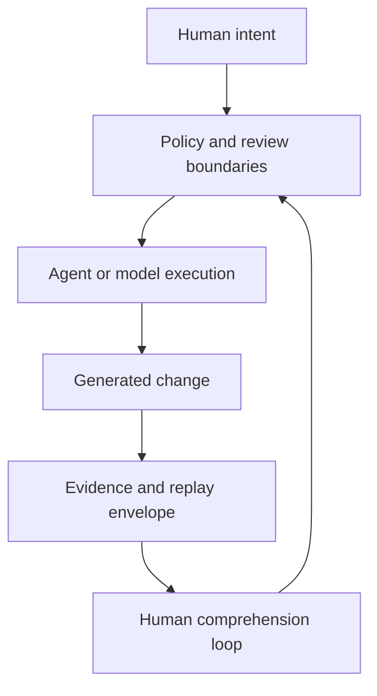

## Generated code changes the control plane

AI-native engineering creates a control-plane problem. Generated code can increase implementation throughput, but without intent capture, execution evidence, review boundaries, replayability guarantees, and human comprehension loops, organizations accumulate technical, cognitive, and intent debt faster than they can repay it.

<Callout>

The bottleneck is shifting from whether agents can produce code to whether organizations can still govern, review, explain, and safely change the systems agents help create.

</Callout>

## The bottleneck has moved

The bottleneck is no longer purely implementation throughput. It is now increasingly governance, replayability, operational trust, organizational memory, reviewability, and comprehension preservation.

Transport-compatible APIs and interchangeable model providers create operational flexibility. They do not create governance equivalence. A local model, an enterprise-hosted provider, a distributed inference fabric, and a public shared service can expose similar APIs while carrying very different trust, retention, locality, and replayability properties.

## The governance surface

Inference-provider selection is not merely infrastructure configuration. It is a governance decision involving locality, retention, replayability, evidence quality, trust boundaries, and policy constraints.

The same applies to prompts, tool access, execution plans, review gates, workflow composition, and write-back operations. These are not incidental implementation details. They are control surfaces.

## Anthesis direction

Anthesis treats prompts, execution, provider routing, replay evidence, workflow composition, approvals, and policy evaluation as explicit governance surfaces. The point is not to eliminate agents. The point is to ensure humans remain capable of review, replay, intervention, attribution, and governance while agents accelerate execution.

## Draft thesis

The next generation of engineering systems may differentiate less on raw generation quality and more on governance clarity, replayability, organizational comprehensibility, bounded autonomy, evidence quality, and intent preservation.

AI-native engineering therefore becomes a systems-governance discipline, not merely a prompting discipline.
