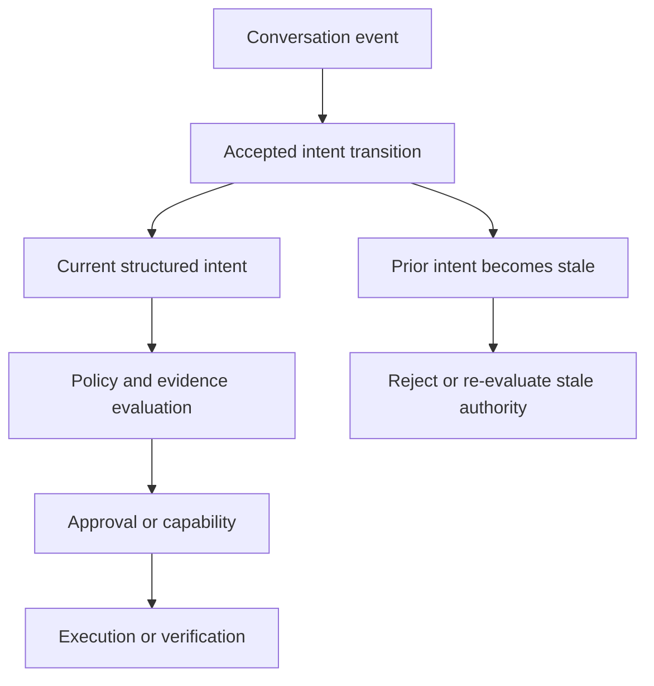

Agentic systems are often given a conversation and expected to infer what the user wants now.

That is convenient for dialogue. It is a weak foundation for authority.

A transcript can contain requests that were later narrowed, assumptions that were corrected, constraints that were added, and tasks that were abandoned entirely. The model may still remember all of them. A tool or authorization layer cannot safely treat all of them as current instructions.

<Callout>

Conversation history is useful evidence. Current intent is security state.

</Callout>

The distinction matters as soon as an agent can cause consequential effects. It determines whether an approval, capability, verification result, or pending action still corresponds to what the user is actually asking for.

## Intent drift can become authority drift

Many agent architectures implicitly assume that intent can be recovered from the latest prompt plus enough conversation context.

Recent research suggests that assumption is fragile. [LLMs Get Lost in Evolving User Intent](https://arxiv.org/abs/2607.20734) evaluates conversations where intent is progressively revealed, revised, or redirected. Strong static-task performance degrades once the target changes across turns.

That result matters beyond model quality.

If a model produces the wrong answer after an intent revision, the problem is correctness.

If the model retains authority derived from the old intent and can invoke tools, modify state, publish an artifact, or deploy software, the same failure becomes a security problem.



Consider a simple interaction:

```text
intent r41: deploy the service
  -> deployment review completed
  -> approval granted

intent r42: actually, only review the configuration
```

The user has changed the requested effect.

A system that treats the conversation as a bag of context still contains the earlier deployment instruction and the approval that followed it. If the deployment capability remains usable, authority has survived after its justification disappeared.

That is close to a time-of-check/time-of-use problem:

```text
intent checked
  -> authority granted
  -> intent materially changes
  -> old authority used anyway
```

The stale object is not merely a cached prompt. It is a cached authorization decision.

## Current intent needs an identity

The safer model is to represent accepted current intent as explicit, versioned state.

```text
conversation event
  -> proposed interpretation
  -> accepted transition
      reveal | revise | switch
  -> structured current intent
      session_ref
      intent_revision
      current_goal
      active_constraints
      authority_relevant_state
      state_digest
  -> governance / execution
```

The exact domain fields will vary. The important property is that authority-relevant intent becomes an identifiable state object rather than an implicit interpretation of a transcript.

Three transition semantics are particularly useful.

### Reveal

A reveal adds information that was previously omitted without necessarily replacing the active goal.

```text
r12: summarize these records
r13: only include records from Canada
```

The new constraint narrows the permitted data set. Any export or capability prepared under the broader state may need re-evaluation.

### Revise

A revision replaces or invalidates previously active state.

```text
r21: publish the release
r22: prepare the release, but do not publish it
```

The second instruction is not merely more context. It removes an effect that was previously in scope.

### Switch

A switch changes the active task while retaining only state that is explicitly still applicable.

```text
r30: diagnose the production deployment
r31: instead, draft an incident summary for review
```

Credentials, approvals, verification, and execution plans appropriate for diagnosis should not automatically become authority for the new task.

## Session identity and intent identity are different

A session can identify the governed interaction: prompt declarations, participants, policy context, model/runtime facts, and provenance associated with the work.

Current intent can still change inside that session.

```text
session S9
  intent r1
  intent r2
  intent r3
  intent r4
```

Creating a new session for every conversational revision would destroy useful continuity. Treating the session itself as current intent creates the opposite problem: mutable authority is difficult to identify precisely.

A consequential effect can instead bind both:

```text
session identity
+ exact intent revision
+ exact state digest
```

This also makes replay more meaningful. Replaying a prompt or session without identifying the intent revision used for authorization may reproduce context while failing to reproduce the decision state.

## History is evidence, not authority

Conversation history still matters.

It can establish:

- how the current intent evolved;
- which constraints were disclosed;
- which state was superseded;
- why a policy decision changed;
- whether an agent ignored a correction;
- what information was available at a particular point in time.

That makes history excellent evidence.

The problem begins when historical text silently re-enters the authority path.

The same rule applies to retrieved memory. An old preference, task, approval, or instruction may inform reasoning, but retrieval should not automatically promote it into current authorized state.

```text
chat history          -> evidence / context
retrieved memory      -> evidence / context
model interpretation  -> proposed state transition
accepted current state -> governance input
```

Making intent explicit does not mean trusting an LLM classifier to declare intent and treating that declaration as ground truth. That would only move the trust problem.

A model can propose:

```text
"Actually, only review it"
        -> proposed transition: deploy -> review
```

But the transition still needs controlled acceptance appropriate to the consequence: deterministic rules, explicit confirmation, schema validation, policy, or approval.

Natural-language interpretation can remain probabilistic. The authority boundary does not have to be.

## Identity is not authority

An exact intent revision solves an identity problem. It does not solve authorization by itself.

A current intent state does not mean an action is allowed. It means the system can identify what current state an authorization decision is supposed to apply to.

Conceptually:

```text
platform capability
  ∩ policy
  ∩ accepted current intent
  ∩ current evidence
  ∩ current approval
  = usable authority
```

Intent can narrow available authority immediately.

If a revised request needs broader authority, the system should perform a fresh governance evaluation. A new natural-language request must not silently widen capability scope.

This is the same separation discussed in [The Missing Layer in Agentic Development: Precise Governance](/blog/governance-native-engineering-control-plane): evidence, policy decisions, and authority are related but different objects.

## From principle to a testable contract

Anthesis now implements this boundary as deterministic contracts rather than relying only on design guidance.

The current state contract records a session reference, monotonic intent revision, active goal and constraints, authority-relevant state, transition lineage, and an RFC 8785-canonicalized SHA-256 state digest.

A smaller **intent subject** projects the exact identity needed downstream:

```text
session_ref
intent_revision
state_digest_algorithm
state_digest
```

Capability envelopes, tool-invocation evidence, and replay records can bind that subject when current intent is material to the decision.

The digest is deliberately limited. It establishes exact state identity. It does not prove that the interpretation was correct, that the producer is trustworthy, that an action is authorized, or that execution completed successfully.

Deterministic conformance then tests the security semantics independently of model answer quality. The current fixture family covers reveal, revise, switch, switch followed by another revision, revision/digest substitution, stale authority, stale completion verification, and attempted direct promotion of retrieved history.

The identity layer produces only three outcomes:

```text
current
stale_or_mismatch
reject_state_promotion
```

There is intentionally no `allow` result.

`current` means only that an exact subject matches accepted current state. Policy still decides what may happen next.

## Precise governance can spend assurance proportionally

The more interesting result appears when exact intent identity is composed with existing policy and evidence layers.

Two deterministic cases exercise different assurance paths.

| Current effect | Risk result | Approval | Policy result |
| --- | --- | --- | --- |
| Draft internal documentation | Tier 0 | none | allow |
| Modify CI/CD workflow | Tier 3 | reviewer | approval required |

Both begin with an exact current intent subject. They do not receive the same process simply because an agent proposed them.

The stale-authority case is different again. When a deployment subject is no longer current after the user revises the task to review-only, the result is **re-evaluate before downstream governance**. The stale fixture does not even carry risk inputs, an approval class, a concrete action, or a request binding forward.

That is the practical connection between intent state and the assurance stack:

```text
exact current intent
  -> risk
  -> required assurance
  -> policy / approval
  -> bounded capability
  -> exact effect
  -> outcome evidence
```

The governance layer can be strict about identity without making every action equally expensive.

## Exact intent still does not identify the exact action

There is one more boundary worth preserving.

Intent identity and action identity are orthogonal.

```text
intent subject
  -> what accepted current state justified this work?

request binding
  -> what exact concrete action is being evaluated or executed?
```

A user may still have the same current intent while an agent changes a concrete target, path, dependency state, or plan.

The conformance work keeps these identities separate. In the CI/CD case, changing only the concrete workflow path changes the request digest even when the higher-level intent remains current.

That prevents "the intent was approved" from becoming a blanket authorization for any implementation the agent later invents.

## What this proves — and what it does not

The deterministic work establishes engineering contracts around evolving intent:

- accepted current intent has an exact versioned identity;
- revisions preserve explicit lineage;
- stale subjects fail closed;
- old verification cannot complete materially newer intent;
- retrieved history cannot silently become current state;
- exact current identity remains separate from policy authorization;
- different consequences can require different assurance;
- concrete effects remain independently bound.

It does **not** prove that a model will always interpret a user's changing request correctly.

It also does not prove that an arbitrary runtime cannot bypass the governance boundary entirely. Runtime enforcement and bypass resistance remain separate security properties.

That separation is useful. Model interpretation can be evaluated as a model-quality problem, while accepted state transitions and authority semantics can be tested as deterministic system contracts.

## The point

Agentic systems need conversation history because collaboration is iterative.

But collaboration also means users change their minds.

Once an agent can cause consequential effects, "what the user currently wants" cannot remain an informal interpretation scattered across a transcript.

It needs an identity, a revision, and a precise relationship to authority.

> **When intent changes materially, authority derived from the old intent must not silently survive.**

Conversation history explains the path.

Current intent governs the next decision.

---

## References

- Jihoon Tack, Philippe Laban, Jennifer Neville, [LLMs Get Lost in Evolving User Intent](https://arxiv.org/abs/2607.20734), 2026.
- Genliang Zhu, Chu Wang, [Intent-Governed Tool Authorization for AI Agents](https://arxiv.org/abs/2606.22916), 2026.
- Anthesis RFC-0034, _Sessions & Prompt Context Governance_.
- Anthesis RFC-0051, _Memory Model and Authority Rules_.
