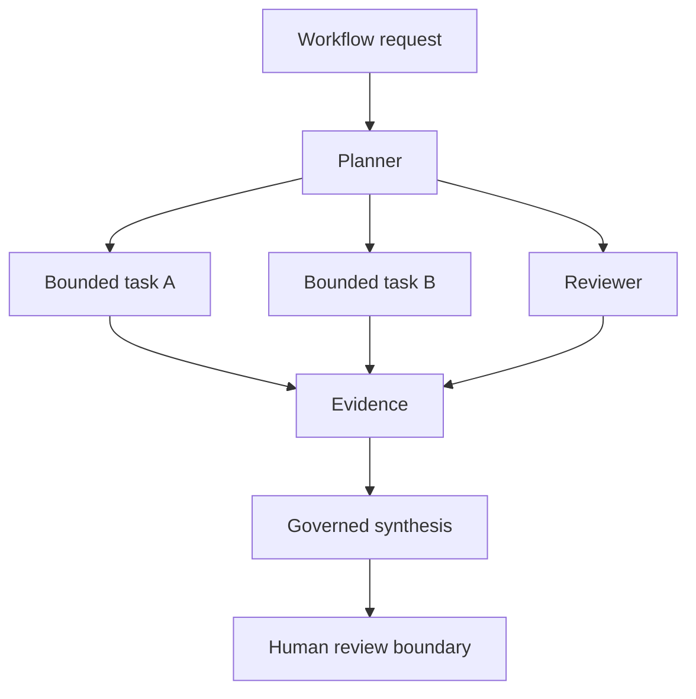

## Recursive agents need governed recursion

Recursive agent systems are becoming increasingly attractive. Hierarchical planners, reviewer trees, recursive decomposition systems, and latent collaboration models promise better reasoning scalability than flat prompting alone.

But recursive systems introduce governance problems. The challenge is not only orchestration. It is governed recursion.

## The core tension

Recursive systems can expand execution depth, execution fan-out, authority propagation, context contamination, replay ambiguity, and provenance collapse faster than traditional orchestration systems were designed to handle.

<Callout>

A workflow cannot claim stronger governance properties than the weakest materially contributing execution boundary.

</Callout>

## Observable vs latent execution

Not all recursive execution is equally observable. Some systems expose explicit execution nodes, review boundaries, execution lineage, and structured delegation. Others operate partly in latent space or opaque runtime layers.

Governance systems must distinguish observable execution, opaque execution, latent execution, and synthesized outputs without pretending complete introspection exists.

## Replayability boundaries

Recursive systems complicate replayability. Advisory branches may remain excluded from a replay envelope, but synthesis-influencing branches become governance-relevant. Latent recursive execution constrains replay ceilings because it contributes to the delivered output without exposing the same evidence surface as explicit execution.

Replayability therefore propagates across execution lineage.

## Anthesis direction

Anthesis treats recursive coordination as profiles over governed execution graphs, bounded execution expansion, evidence-linked workflow composition, and policy-governed delegation rather than unrestricted autonomous recursion.

The long-term challenge is not simply building more capable recursive agents. It is ensuring humans remain capable of comprehension, intervention, replay, audit, and authority governance after recursive systems become operationally useful.
