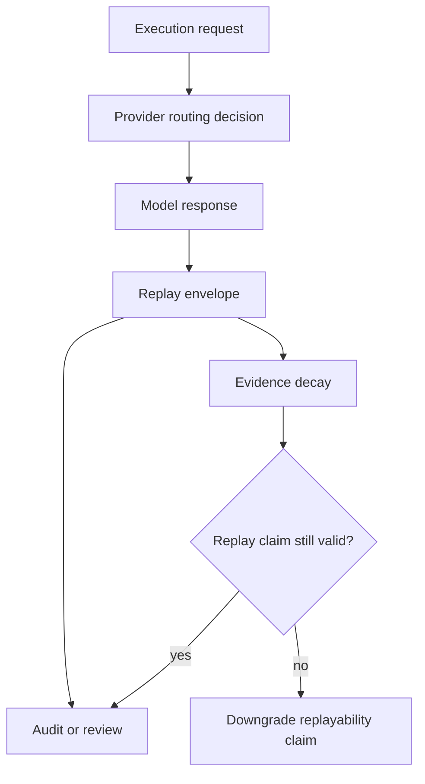

## Determinism is not the whole problem

Most conversations around AI reproducibility focus on determinism. That matters, but deterministic replay is only one part of the problem. The larger issue is governance: whether an organization can explain what happened, why it happened, under whose authority it happened, and what evidence still exists to support that claim.

<Callout>

Replayability in AI-native systems is not just reproducibility engineering. It is governance infrastructure.

</Callout>

## Replayability vs reproducibility

Traditional software systems often assume identical binaries, stable execution environments, deterministic inputs, and recoverable runtime state. AI systems violate many of those assumptions.

Providers change. Models mutate. Routing changes. Retention windows expire. Metadata disappears. As a result, replayability becomes an evidence problem, not only a runtime problem.

## Replayability ceilings

Different inference providers support different replayability ceilings. A local deterministic runtime and a shared external provider may expose compatible APIs while offering radically different replay guarantees.

Replayability must therefore be explicit, policy-aware, evidence-backed, and surfaced to governance systems rather than hidden behind SDK abstractions.

## Replayability decay

Replayability is not static. It decays over time as models are replaced, provider attestations expire, evidence is garbage-collected, execution metadata disappears, and retention windows close.

Governance systems should model that decay explicitly. A system should not silently preserve a stronger replayability claim after the evidence required to support it has expired.

## Anthesis perspective

Anthesis treats replayability as a first-class governance surface. Replay evidence is attached to workflow execution, provider routing, execution lineage, policy evaluation, and governance signals.

The goal is not perfect determinism. The goal is bounded explainability and attributable execution.
