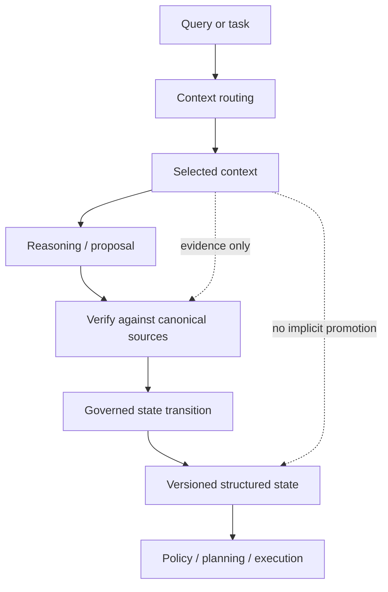

Agents live inside context windows.

Systems should not.

A context window is assembled for a particular reasoning step. It can contain retrieved documents, summaries, tool output, prior messages, examples, cached observations, and generated notes. Some of that material may be useful. Some may be stale. Some may conflict. Some may only be present because a router decided it looked relevant.

None of those properties make it current truth.

<Callout>

Loading information is not a state transition.

</Callout>

That boundary sounds obvious until an agent starts using retrieved material to plan, request capabilities, modify repositories, update infrastructure, or approve the next action in a workflow.

At that point, confusing context with state is no longer just a retrieval-quality problem. It is a control-boundary problem.

## Relevance is not authority

Retrieval systems answer a useful question:

> What information is likely to help with this task?

Governed systems need several different questions answered as well:

```text
Is this relevant?
Is this authoritative?
Is this still current?
Is this allowed to influence this decision?
```

Those are not interchangeable.

A highly relevant document can be obsolete. A current document can be non-authoritative. An authoritative policy can be irrelevant to the current task. A generated summary can accurately describe a canonical source without inheriting that source's authority.

A useful shorthand is:

```text
relevance != authority != current truth
```

Semantic similarity does not change that equation.

## The context window is a workspace

Context is best treated as a temporary reasoning workspace.

It exists to help a model interpret a task, compare evidence, generate a proposal, or explain a result. The exact contents may vary by route, budget, model, session, or retrieval strategy.

Authoritative state has a different job.

It represents the smallest explicit set of facts the system is currently prepared to rely on for consequential decisions.

That state should have stronger properties:

- a defined owner;
- a defined scope;
- an exact identity or revision;
- controlled mutation rules;
- provenance;
- conflict handling;
- externally inspectable representation where practical.

Anthesis formalizes this split by treating structured state as current truth within a governed scope, while retrieval memory and conversation history remain lower-authority inputs. The previous Assurance Stack article applied the same rule specifically to evolving user intent: historical conversation can explain how an agent arrived at a decision, but accepted current intent needs its own exact identity.

The broader rule is the same.

Context may inform state. It should not silently become state.



## Retrieval selects evidence; it does not mutate truth

Consider a repository with three pieces of information:

```text
README.md:
  deployments target production by default

architecture/current-environments.md:
  default target is staging

structured deployment state:
  environment = staging
  revision = 27
```

A semantic query for "deployment target" might retrieve all three.

The model now has conflicting context.

That is not necessarily a failure. The context window is allowed to contain evidence that disagrees. Reasoning often requires exactly that.

The failure would be allowing whichever fragment is most salient to redefine system state.

A safer sequence is:

```text
retrieve
  -> compare
  -> identify authority
  -> resolve conflict
  -> propose state change, if needed
  -> apply through controlled mutation
```

The state transition is explicit.

The retrieval event is not.

## Summaries should reduce cost, not create a second truth

Large repositories create a practical problem: loading every authoritative document for every task is expensive and often unnecessary.

Repora addresses this with [hierarchical routing summaries](https://github.com/hackelia-micrantha/repora/blob/main/docs/routing/summaries.md).

A small `SUMMARY.md` can orient an agent before deeper material is loaded. It can identify:

- what a subtree owns;
- which documents are canonical;
- which boundaries matter;
- when deeper retrieval is required;
- which areas are generated, stale, experimental, or excluded.

The important part is not the summary itself. It is the trust boundary around it.

Repora classifies these summaries as generated orientation material. Explicit routing can make them eligible for selection, but eligibility does not make them canonical.

That creates a useful pattern:

```text
small summary
  -> orient
  -> stop for low-consequence overview

small summary
  -> identify canonical source
  -> expand
  -> verify exact contract
  -> plan or mutate
```

The system can save tokens without collapsing the distinction between an index and the source it indexes.

That is a better optimization target than simply placing more information into the prompt.

## Exact decisions require expansion

Summary-first retrieval only works if the system knows when summaries are insufficient.

Repora requires expansion when the task depends on exact behavior, compatibility, security semantics, implementation comparison, mutation planning, or any claim that may be ambiguous or stale.

That rule is more important than the summary format.

It turns progressive disclosure into an assurance decision.

For an orientation question:

```text
What does this subsystem own?
```

A concise summary may be sufficient.

For a consequential question:

```text
Can this code path bypass authorization when the fallback route is used?
```

The summary is only a pointer.

The system needs the canonical policy, relevant implementation, and often executable evidence.

The same context strategy should not be used for both decisions simply because both mention the same subsystem.

## Trust metadata should survive compression

Compression is useful because context is expensive.

Compression is dangerous when it erases where information came from.

A generated summary, cached note, model-produced recap, and ratified policy may all fit into a few paragraphs. Once flattened into plain text, they can look equally authoritative to a language model.

The control plane should preserve the distinction outside the prose.

Useful metadata includes:

```text
source identity
source revision
trust class
generation method
content digest
selection reason
scope
staleness or supersession status
```

The model does not need to invent those facts. The surrounding system can supply them deterministically.

This matters because context engineering is not only about selecting the right text. It is also about preserving the semantics of the selected text.

## Provenance explains context. It does not authorize it.

Repora's [context receipts](https://github.com/hackelia-micrantha/repora/blob/main/docs/routing/context-receipts.md) make routed context inspectable.

A receipt can identify the repository revision, routing policy digest, selected paths, trust tiers, content hashes, exclusions, and consumed budgets. For the same routing inputs, the receipt is designed to serialize deterministically.

That is valuable evidence.

It still does not make the selected material authoritative.

A receipt can prove that a generated summary was selected from a particular revision under a particular routing policy. It cannot prove that the summary is correct. It cannot promote the summary into current state. It cannot authorize a mutation.

The distinction mirrors the rest of the Assurance Stack:

```text
selection evidence
!= content authority
!= policy decision
!= execution authority
```

Provenance should make a decision explainable and challengeable. It should not silently grant the decision more authority than it already had.

## Promotion should be a governed write

Sometimes retrieved context contains information that genuinely should become current state.

That is normal.

The safe operation is explicit promotion.

```text
retrieved claim
  -> source verification
  -> conflict check
  -> proposed state mutation
  -> policy / approval, when required
  -> new state revision
  -> attributable evidence
```

For example:

```text
retrieved release note:
  service v4 removes legacy endpoint

current structured state:
  legacy endpoint = supported
```

The release note may be correct. It may also refer to a different branch, environment, or release candidate.

The retrieval layer should not rewrite support state merely because the note entered context.

The system can verify the authoritative release artifact, determine scope, and then update structured state through a defined mutation path.

That path gives the change an owner and an identity.

Without it, memory becomes an ambient write channel.

## State should be smaller than context

A useful architecture does not try to make every useful fact authoritative.

That would recreate the context window as a database.

Structured state should remain deliberately small.

It should contain the current facts that materially affect planning, policy, authorization, or execution. Everything else can remain retrieval material until needed.

That produces a healthier shape:

```text
large historical knowledge
        ↓ selective retrieval
small task context
        ↓ verification / promotion
smaller authoritative state
        ↓ governance
bounded consequence
```

The benefit is not only token efficiency.

Small authoritative state is easier to:

- version;
- diff;
- validate;
- replay;
- sign or digest;
- approve;
- invalidate;
- reason about during incident review.

A system that externalizes current truth also becomes less dependent on any single model's ability to reconstruct that truth from a long prompt.

## Multi-agent systems make the distinction harder to ignore

With one agent, context drift may look like a bad answer.

With several agents, it can become distributed state corruption.

A supervisor may retrieve one version of a constraint. A specialist may receive a compressed summary. Another specialist may load an older design note. Each can produce locally plausible reasoning from a different context slice.

If context is treated as authoritative state, there is no stable object to reconcile against.

A shared structured state gives the topology a common boundary:

```text
supervisor context   ----\
specialist context   -----+--> governed structured state
reviewer context     ----/           |
                                     v
                              policy / authority
```

The contexts may differ.

The authority-relevant state should not.

That is the same reason intent revision needs an exact identity and replayability needs more than prompt reproduction. Agentic systems need stable external objects at the points where consequences depend on them.

## Where this fits in the Assurance Stack

The Assurance Stack separates different jobs rather than asking one mechanism to do all of them.

```text
context routing      -> What information should be considered?
reasoning / review   -> What does the evidence suggest?
verification         -> What can be checked executably?
structured state     -> What is current truth within scope?
policy governance    -> What assurance and authority are required?
capability            -> What bounded action may proceed?
execution evidence   -> What actually happened?
```

Context engineering belongs in the stack.

It should not swallow the rest of it.

A larger context window does not eliminate the need for current state. Better retrieval does not eliminate policy. Deterministic routing does not create authorization. Provenance does not prove correctness.

Each layer becomes more useful when those boundaries remain explicit.

## What the Micrantha projects are testing

The useful pattern emerging across Anthesis and Repora is simple:

1. **Keep current truth external and explicit.**
   Authority-relevant state has an identity outside the model context.

2. **Treat retrieved material as evidence by default.**
   Relevance can influence reasoning without changing authority.

3. **Route progressively.**
   Small summaries can answer orientation questions; exact decisions expand into canonical sources.

4. **Preserve trust information.**
   Generated, historical, canonical, and normative material should not flatten into one undifferentiated prompt.

5. **Record selection separately from authority.**
   Context receipts can explain why material was loaded without making it executable authority.

6. **Make promotion explicit.**
   When evidence should change current truth, perform a governed state transition rather than an implicit memory update.

The result is not a smarter prompt.

It is a cleaner control boundary.

## The point

Agentic systems need context. They also need to survive incorrect, incomplete, stale, compressed, and mutually inconsistent context.

That becomes much easier when the system has somewhere else to put truth.

Context can remain broad, adaptive, and cheap to reconstruct.

State can remain small, exact, versioned, and governable.

The distinction is what allows both to improve independently.

**Context helps decide what to consider. State determines what the system is prepared to treat as true.**
