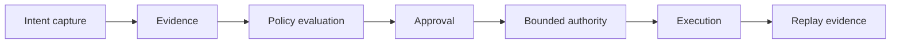
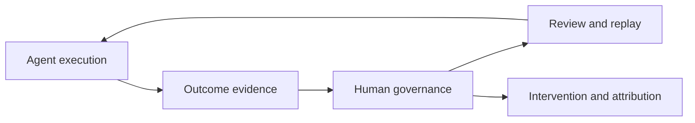

AI-native engineering creates a control-plane problem.

Generated code increases throughput. Without intent capture, evidence, review boundaries, replayability guarantees, and human comprehension loops, organizations accumulate technical, cognitive, and intent debt faster than they can repay it.

## The bottleneck has moved

The bottleneck is no longer purely implementation throughput.

It is increasingly:

- governance
- replayability
- operational trust
- organizational memory
- reviewability
- comprehension preservation

Transport-compatible APIs and interchangeable model providers create operational flexibility, but they do not create governance equivalence.

## The governance surface

Inference-provider selection is not merely infrastructure configuration.

It is a governance decision involving:

- locality
- retention
- replayability
- evidence quality
- trust boundaries
- policy constraints

This suggests AI-native systems require governance-native architecture.

## Anthesis direction

Anthesis treats:

- prompts
- execution
- provider routing
- replay evidence
- workflow composition
- approvals
- policy evaluation

as explicit governance surfaces.

The goal is not to eliminate agents.

The goal is to ensure humans remain capable of:

- review
- replay
- intervention
- attribution
- governance

while agents accelerate execution.

## Differentiation moves to governance

The next generation of engineering systems will likely differentiate not on raw generation quality, but on:

- governance clarity
- replayability
- organizational comprehensibility
- bounded autonomy
- evidence quality
- intent preservation

AI-native engineering therefore becomes a systems-governance discipline, not merely a prompting discipline.
