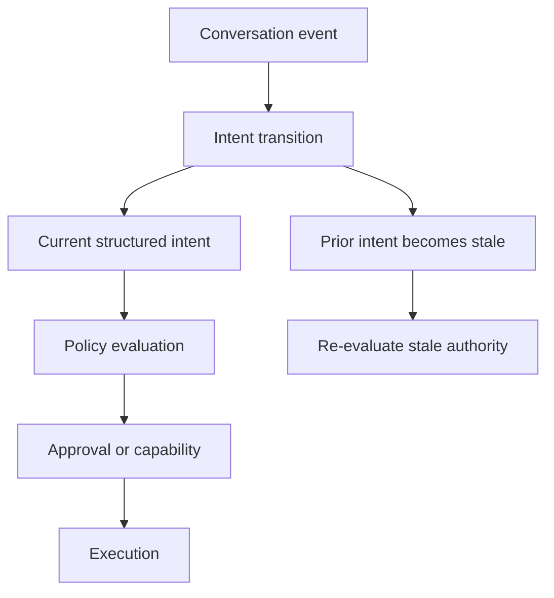
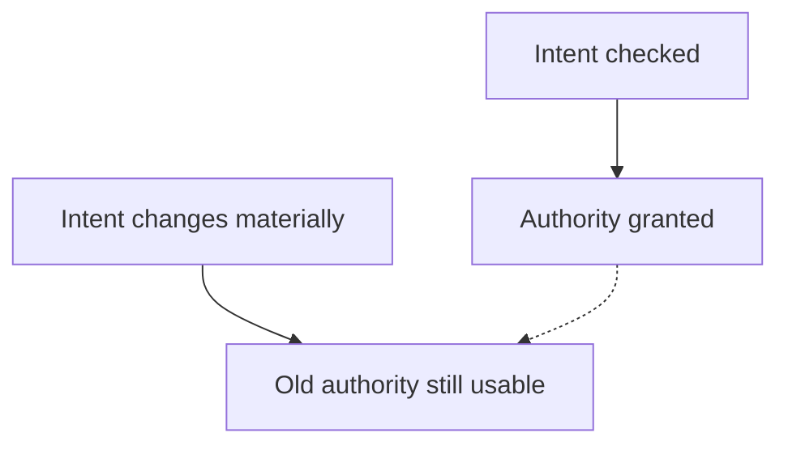
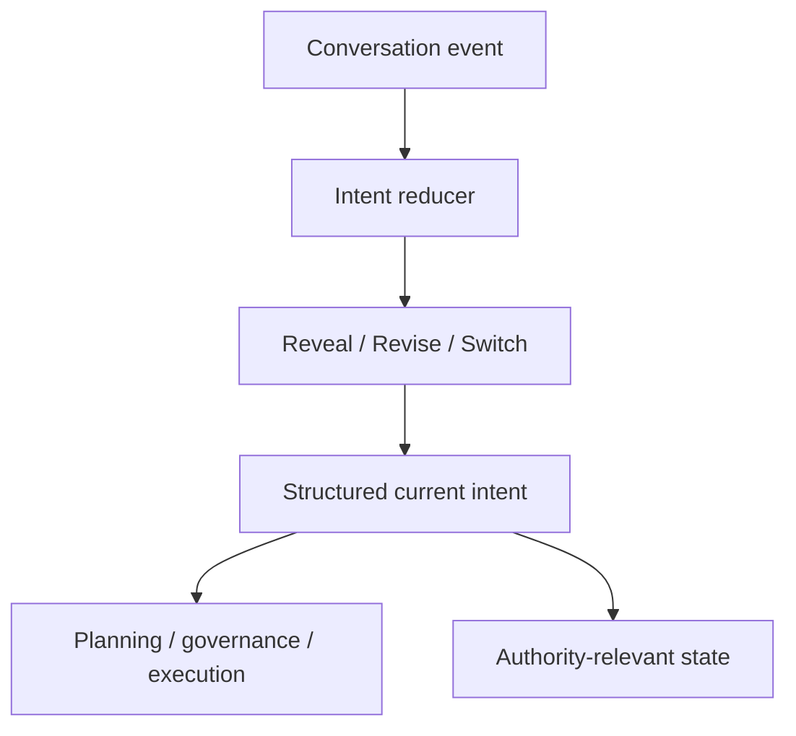
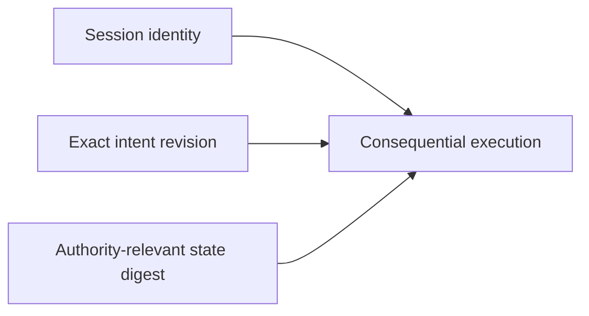
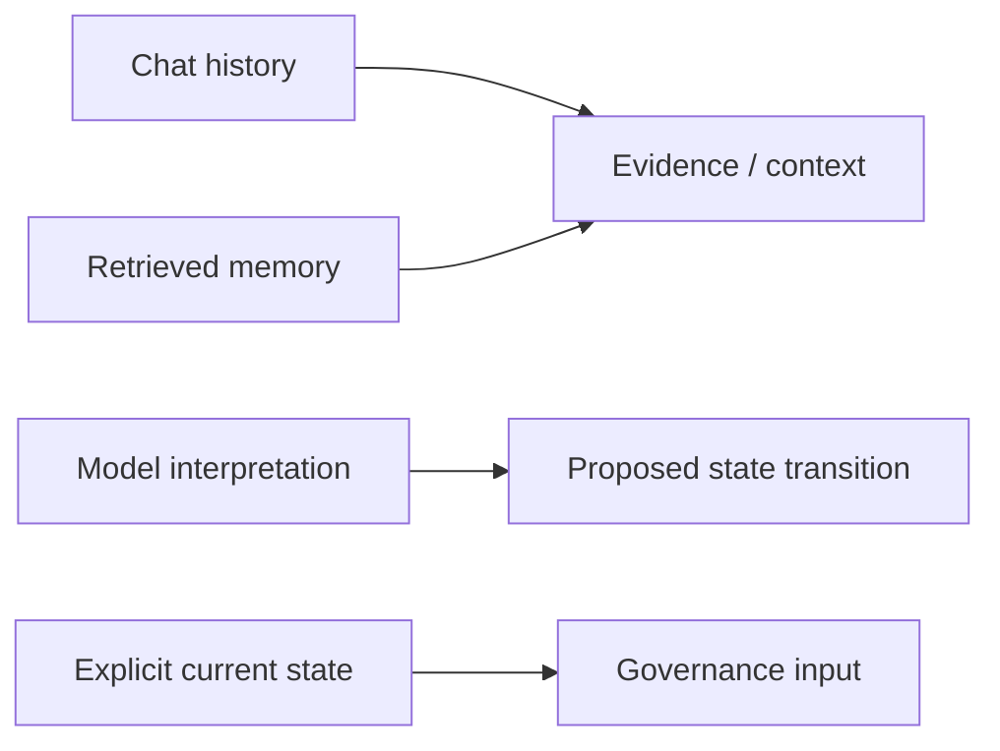
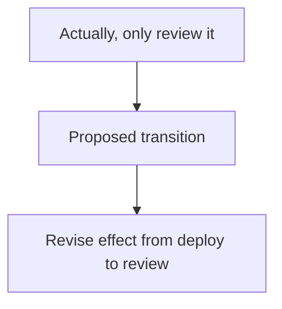
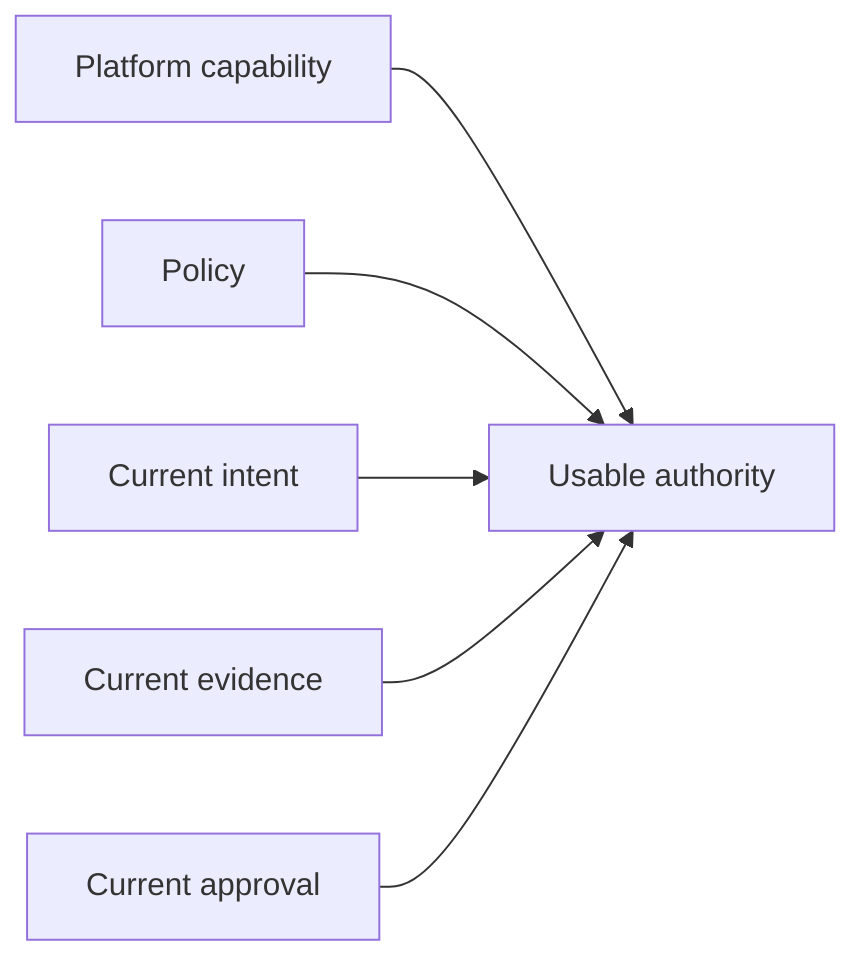
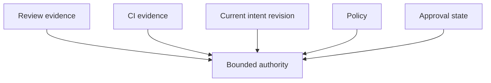

Agentic systems are often given a conversation and expected to infer what the user wants now.

That is convenient for dialogue. It is a weak foundation for authority.

A transcript can contain requests that were later narrowed, assumptions that were corrected, constraints that were added, and tasks that were abandoned entirely. The model may still remember all of them. A tool or authorization layer cannot safely treat all of them as current instructions.

The distinction becomes important as soon as an agent can cause consequential effects.

> Conversation history is useful evidence. Current intent is security state.

The difference is not semantic bookkeeping. It determines whether an approval, capability, or tool invocation still corresponds to what the user is actually asking for.

## The static-intent assumption is breaking down

Many agent architectures implicitly assume that intent can be recovered from the latest prompt plus enough conversation context.

Recent research suggests that assumption is fragile.

The paper [LLMs Get Lost in Evolving User Intent](https://arxiv.org/abs/2607.20734) evaluates models in conversations where user intent is progressively revealed, revised, or redirected. Strong performance in static, fully specified settings drops substantially once the task evolves across turns.

That result matters beyond model quality.

If a model merely produces the wrong answer after an intent revision, the problem is correctness.

If the model retains authority derived from the old intent and can invoke tools, modify state, publish an artifact, or deploy software, the same failure becomes a security problem.



## Intent drift can become authority drift

Consider a simple interaction:

```text
intent r41: deploy the service
  -> deployment review completed
  -> approval granted

intent r42: actually, only review the configuration
```

The user has changed the requested effect.

A system that treats the conversation as a bag of context may still contain the earlier deployment instruction and the approval that followed it. If the deployment capability remains usable, the system has preserved authority after its justification disappeared.

That is close to a time-of-check/time-of-use problem:



The stale object is not only a cached prompt. It is a cached authorization decision.

The safe response is not to delete conversation history. The safe response is to distinguish historical context from authoritative current state.

## Current intent needs an identity

A useful model is to give current intent an explicit revision.



The structured object carries fields such as:

- `intent_revision`
- `current_goal`
- `active_constraints`
- `retained_state`
- `superseded_state`
- `invalidated_state`
- `state_digest`

The exact schema will vary by system. The important property is that authority-relevant intent becomes an identifiable state object rather than an implicit interpretation of a transcript.

That produces several useful invariants.

### Reveal

A reveal adds information that was previously omitted without necessarily replacing the active goal.

```text
r12: summarize these records
r13: only include records from Canada
```

The new constraint may narrow the permitted data set. Any previously prepared export or capability that covered a broader set should be reconsidered.

### Revise

A revision changes or invalidates previously active state.

```text
r21: publish the release
r22: prepare the release, but do not publish it
```

The second instruction is not merely more context. It removes an effect that was previously in scope.

### Switch

A switch changes the active task while retaining only state that is explicitly still applicable.

```text
r30: diagnose the production deployment
r31: instead, draft an incident summary for review
```

Credentials, approvals, execution plans, or retrieved context that were appropriate for diagnosis should not automatically become authority for the new task.

## Session identity and intent identity are different

There is another distinction worth preserving.

A session can identify the governed interaction: the prompt declaration, participants, model/runtime facts, policy context, and provenance associated with a conversation.

Current intent is mutable inside that session.

```text
session S9
  intent r1
  intent r2
  intent r3
  intent r4
```

Creating a new session for every conversational change would destroy useful continuity. Treating the session itself as the current intent would make mutable authority difficult to identify.

The cleaner model is to bind consequential execution to both:



Replay then becomes more meaningful as well. Replaying a prompt or session without identifying the exact intent revision used for authorization may reproduce context while failing to reproduce the decision state.

## History is evidence, not authority

Conversation history still matters.

It can establish:

- how the current intent evolved;
- which constraints were disclosed;
- which state was superseded;
- why a policy decision changed;
- whether an agent ignored a correction;
- what information was available at a particular point in time.

That makes history excellent evidence.

The problem begins when historical text is allowed to silently re-enter the authority path.

The same rule should apply to retrieved memory. A previous preference, old task, prior approval, or historical instruction can inform reasoning, but retrieval should not automatically promote it into current authorized state.



This separation also limits the damage from stale or poisoned memory. A retrieved statement can influence a proposed update without becoming authoritative merely because it was found.

## Intent extraction should not become a new oracle

Making intent explicit does not mean trusting an LLM classifier to declare the user's intent and then treating that declaration as ground truth.

That would simply move the trust problem.

The model can propose a normalized interpretation:



But consequential state transitions still need controlled semantics.

Depending on the effect, that can involve:

- deterministic transition rules;
- explicit user confirmation;
- policy checks;
- schema validation;
- comparison with the prior state;
- approval invalidation;
- audit evidence describing what changed.

Natural-language interpretation remains probabilistic. The state machine around authority does not have to be.

## Intent should narrow authority before it can expand it

A useful authorization principle is that interpreted intent should not silently grant more power than the underlying integration, policy, or approval already permits.

Recent work on [Intent-Governed Tool Authorization](https://arxiv.org/abs/2606.22916) makes a similar distinction: static tool credentials answer whether an integration _can_ perform an operation, while current user intent constrains whether that operation is justified for this task.

That suggests a layered rule:



Intent can narrow the available authority immediately.

If revised intent would require broader authority, the system should perform a new policy and approval evaluation rather than treating the new natural-language request as an automatic permission expansion.

## Bind authority to the revision that justified it

Once current intent has an explicit identity, downstream objects can bind to it.

An approval can record:

```text
session: S9
intent_revision: 41
state_digest: sha256:...
approved_effect: deploy service A to production
```

A capability can carry the same binding.

An execution request can prove which revision it is using.

The governance boundary can then reject stale authority deterministically:

```text
current intent revision = 42
capability intent revision = 41
material authority state changed = true

result: re-evaluate / deny stale capability
```

This is much easier to reason about than asking a model whether an old approval "still seems relevant."

## Precise governance depends on precise state

The first Assurance Stack article argues that AI review, CI/CD verification, and policy governance solve different problems.

Intent state is part of what makes the governance layer precise.

AI review can judge whether a proposed change makes sense.

CI/CD can establish that the change passes executable checks.

Neither can answer whether the effect still corresponds to the user's current request if the authority layer cannot identify what "current" means.



This is especially important for long-running agent workflows. The longer an agent operates, the more likely the user is to refine the task, change a constraint, redirect the work, or withdraw an earlier instruction.

Long context windows make more history available. They do not make that history authoritative.

## Anthesis direction

Anthesis is exploring this boundary as explicit evolving-intent state rather than transcript reinterpretation.

The current design work separates:

- immutable session/context identity;
- mutable current-intent revisions;
- reveal, revise, and switch transitions;
- retained, superseded, and invalidated state;
- canonical identity for authority-relevant current state;
- policy, approval, capability, and effect binding to that state;
- rejection or re-evaluation of stale authority after material changes.

The first useful conformance target is deliberately deterministic. Fixture-backed scenarios can verify that an intent revision changes governance state correctly without depending on a particular LLM to produce a good final answer.

That keeps two questions separate:

1. Did the model understand the evolving request correctly?
2. Given an accepted state transition, did the governance system preserve the correct authority semantics?

The first remains a model-quality problem.

The second can and should be tested as an engineering contract.

## The point

Agentic systems need conversation history because collaboration is iterative.

But collaboration also means users change their minds.

Once an agent can cause consequential effects, "what the user currently wants" cannot remain an informal interpretation scattered across a transcript.

It needs an identity, a revision, and a relationship to authority.

The critical rule is simple:

> **When intent changes materially, authority derived from the old intent must not silently survive.**

Conversation history explains the path.

Current intent governs the next effect.

---

## References

- Jihoon Tack, Philippe Laban, Jennifer Neville, [LLMs Get Lost in Evolving User Intent](https://arxiv.org/abs/2607.20734), 2026.
- Genliang Zhu, Chu Wang, [Intent-Governed Tool Authorization for AI Agents](https://arxiv.org/abs/2606.22916), 2026.
- Anthesis issue #153, _Add evolving-intent state-transition conformance and intent-revision binding_.
