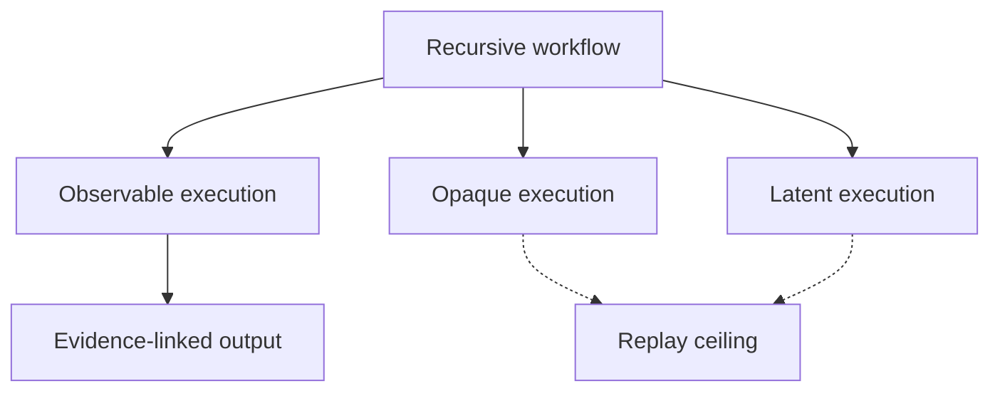
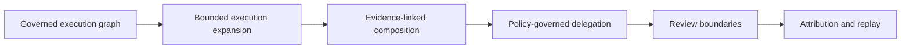

Recursive agent systems are becoming increasingly attractive.

Hierarchical planners, reviewer trees, recursive decomposition systems, and latent collaboration models promise better reasoning scalability than flat prompting alone.

But recursive systems introduce governance problems.

## The core tension

Recursive systems can expand:

- execution depth
- execution fan-out
- authority propagation
- context contamination
- replay ambiguity
- provenance collapse

faster than traditional orchestration systems were designed to handle.

The challenge is therefore not only orchestration.

It is governed recursion.

## Observable vs latent execution

Not all recursive execution is equally observable.

Some systems expose:

- explicit execution nodes
- review boundaries
- execution lineage
- structured delegation

Others operate partly in latent space or opaque runtime layers.

Governance systems must distinguish between:

- observable execution
- opaque execution
- latent execution
- synthesized outputs

without pretending complete introspection exists.

## Replayability boundaries

Recursive systems complicate replayability.

A workflow cannot claim stronger replay guarantees than the weakest materially contributing execution boundary.

This creates a governed-delivery-path model:

- advisory branches may remain excluded
- synthesis-influencing branches become governance-relevant
- latent recursive execution constrains replay ceilings

Replayability therefore propagates across execution lineage.

## Anthesis direction

Anthesis treats recursive coordination as:

- profiles over governed execution graphs
- bounded execution expansion
- evidence-linked workflow composition
- policy-governed delegation

rather than unrestricted autonomous recursion.

This preserves:

- replayability
- attribution
- approvals
- policy enforcement
- reviewability
- bounded authority

while still allowing recursive coordination.

## Governance-native recursion

The long-term challenge is not simply building more capable recursive agents.

It is ensuring humans remain capable of:

- comprehension
- intervention
- replay
- audit
- authority governance

after recursive systems become operationally useful.

That likely requires governance-native recursive execution models rather than purely capability-native architectures.
