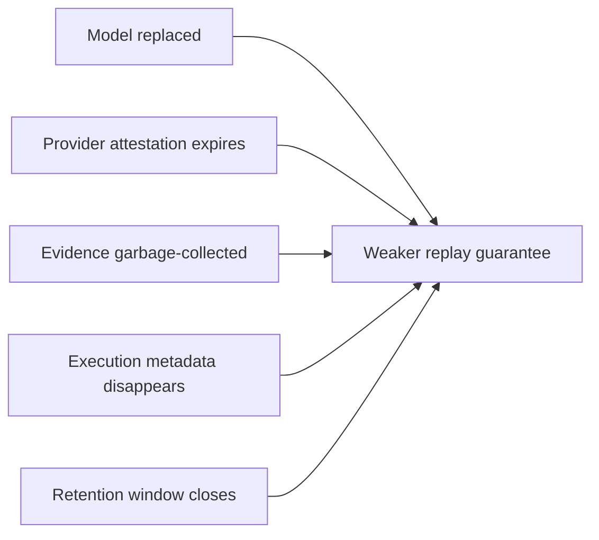
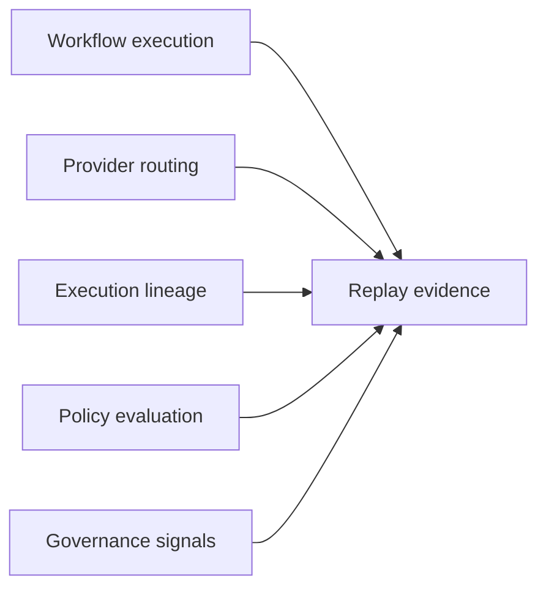

Most conversations around AI reproducibility focus on determinism.

But deterministic replay is only one small part of the problem.

The larger issue is governance.

## Replayability vs Reproducibility

Traditional software systems often assume:

- identical binaries
- stable execution environments
- deterministic inputs
- recoverable runtime state

AI systems violate many of those assumptions.

Providers change.
Models mutate.
Routing changes.
Retention windows expire.
Metadata disappears.

Replayability therefore becomes an evidence problem.

## Replayability ceilings

Different inference providers support different replayability ceilings.

A local deterministic runtime and a shared external provider may expose identical APIs while offering radically different replay guarantees.

This means replayability must become:

- explicit
- policy-aware
- evidence-backed
- surfaced to governance systems

rather than hidden behind SDK abstractions.

## Replayability decay

Replayability is not static.

It decays over time.

Replay guarantees weaken as:

- models are replaced
- provider attestations expire
- evidence is garbage-collected
- execution metadata disappears
- retention windows close

Governance systems must model replayability degradation explicitly.

## Anthesis perspective

Anthesis treats replayability as a first-class governance surface.

Replay evidence is attached to:

- workflow execution
- provider routing
- execution lineage
- policy evaluation
- governance signals

The goal is not perfect determinism.

The goal is bounded explainability and attributable execution.

## The emerging discipline

AI-native engineering systems will likely require:

- replay envelopes
- evidence taxonomies
- locality evidence
- provider trust semantics
- governance-aware routing
- human review boundaries

Replayability is no longer merely a debugging concern.

It is organizational infrastructure.
