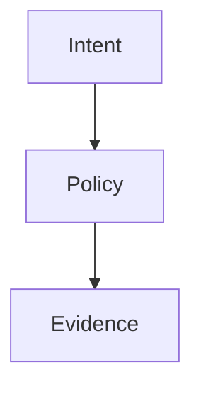

# Blog publication workflow

## Decision

Canonical MDX frontmatter is the complete source of truth for article metadata.

Every published article lives in a native Remix route directory:

```text
app/routes/blog.<slug>/
├── content.mdx
└── route.tsx
```

The route imports its own `content.mdx` at build time and passes that component to the shared route adapter. There is no generic article loader, request-time filesystem access, runtime MDX compilation, or external content evaluation.

This preserves complete server rendering, JavaScript-disabled access, deterministic Cloudflare builds, and independent browser chunks for each article.

## Canonical frontmatter

Each `content.mdx` file must define:

```yaml
---
slug: example-article
status: published
title: Example Article
description: A concise search and social description.
date: "2026-08-03"
updatedAt: "2026-08-03" # optional; must be on or after date
excerpt: A concise index and related-content summary.
tags:
  - architecture-notes
relatedSlugs:
  - another-article
series:
  slug: example-series
  order: 1
---
```

The supported publication statuses are:

- `published`
- `draft`

The frontmatter parser is intentionally strict. Unknown top-level fields, unknown nested series fields, missing fields, invalid dates, an `updatedAt` value before `date`, duplicate tags or related posts, unknown related slugs, self-references, invalid series membership, duplicate order values, and series ordering gaps fail validation. When present, `updatedAt` is projected into article metadata and JSON-LD and becomes the sitemap `lastmod` value.

## Generated projections

Runtime code does not parse MDX or import article bodies into shared modules. Instead, the repository checks in two deterministic projections:

- `app/content/blog.generated.ts` — metadata-only runtime records;
- `public/sitemap.xml` — public URL and `lastmod` records.

Generate both files with:

```sh
yarn generate:blog-content
```

The generator discovers canonical route frontmatter, validates relationships, formats the TypeScript projection with the repository Prettier configuration, and writes both outputs from the same inventory.

Required CI compares both files byte-for-byte with freshly generated output. Editing a projection by hand or changing frontmatter without regenerating it fails the build.

## Publication cutoff

Validation uses the current UTC calendar date by default.

`BLOG_PUBLICATION_DATE=YYYY-MM-DD` may be supplied explicitly for a scheduled build or dated preview. Production CI and normal deployment leave this variable unset unless an intentional dated release is being exercised.

A routable article must:

- declare `status: published`;
- use a valid calendar date;
- have a date on or before the publication cutoff.

Draft or future content must remain outside the routable `app/routes/blog.<slug>/` namespace until publication. Hiding a route only from the index or sitemap is insufficient because its direct URL would still exist.

## Authoring a draft

1. Author the MDX outside the routable route namespace.
2. Use the same canonical frontmatter schema with `status: draft`.
3. Keep draft assets local and validate them through a non-production authoring workflow.
4. Move the article into `app/routes/blog.<slug>/` only when publication is intentional.
5. Change `status` to `published`, verify the date, and regenerate projections.

## Publishing an article

1. Add `app/routes/blog.<slug>/content.mdx` with canonical frontmatter and approved MDX syntax.
2. Add a minimal native route wrapper:

   ```tsx
   import { createBlogMdxRoute } from "~/content/blog-mdx-route"

   import Content from "./content.mdx"

   const route = createBlogMdxRoute("example-article", Content)

   export const meta = route.meta
   export const handle = route.handle
   export default route.Component
   ```

3. Run:

   ```sh
   yarn generate:blog-content
   yarn test:unit
   yarn test:blog-mdx-validation
   yarn test:blog-content-boundaries
   yarn typecheck
   yarn build
   yarn test:blog-chunk-isolation
   yarn cloudflare:functions:build
   yarn test:integration
   yarn test:e2e
   yarn test:e2e:cloudflare
   ```

4. Verify the article appears in the index, series navigation, related links, structured data, sitemap, and its own browser route chunk.

## Browser chunk isolation

Every article route must have a distinct browser module. The build check reads the generated Remix browser manifest, follows each route's static import graph, and verifies:

- the graph contains that article's unique body marker;
- the graph contains none of the other article bodies;
- every article has a distinct route module.

Shared metadata contains titles, descriptions, excerpts, tags, and relationships only. Full article prose remains in route-local MDX chunks and is not pulled into the blog index, series pages, or unrelated article routes.

## Mermaid diagrams in MDX

Mermaid diagrams use inert fenced code rather than JSX props or executable expressions. The first two source lines are required metadata comments, followed by the chart:

````md

````

The MDX component map upgrades only `language-mermaid` code blocks. Server rendering and JavaScript-disabled clients receive the complete title, caption, and chart source. After hydration, the existing Mermaid client renders an SVG under `securityLevel: "strict"`.

The shared parser and build boundary enforce:

- required non-empty title and caption metadata;
- a maximum title of 160 characters and caption of 320 characters;
- a maximum chart source of 4,000 characters;
- directed `flowchart` or `graph` syntax with an explicit direction;
- no Mermaid initialization directives, links, callbacks, JavaScript URLs, HTML, or control characters.

Malformed Mermaid content fails before deployment. Authors must not import Mermaid, provide JSX expressions, or embed rendered SVG directly in MDX.

## Test layers

- Unit tests exercise publication dates, cutoff behavior, draft exclusion, future-date rejection, unsupported status rejection, and constrained Mermaid parsing.
- Content-boundary integration validates canonical frontmatter, generated metadata and sitemap parity, publication rules, series and related-post relationships, MDX grammar, local assets, static-only routing, and every Mermaid block.
- Build integration verifies browser chunk isolation, the direct Cloudflare Pages adapter, the source-isolated workerd artifact, and the Worker bundle budget.
- End-to-end tests exercise all articles in desktop and mobile Chromium, hydrated client navigation, Mermaid enhancement, complete JavaScript-disabled rendering, and unpublished or unknown route exclusion.
